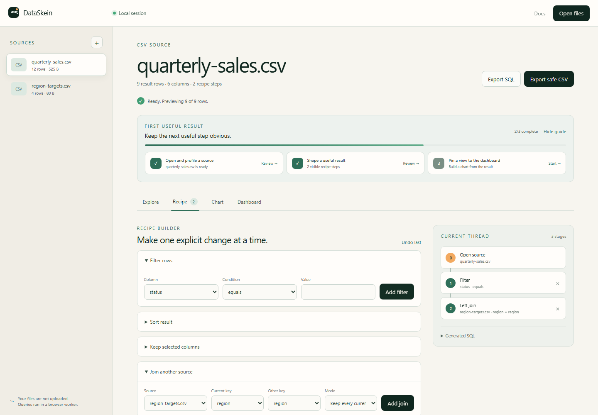
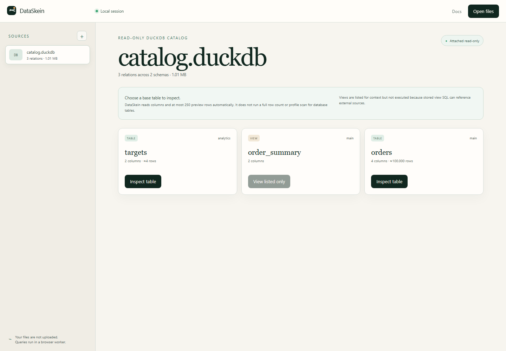

# DataSkein

**Follow the thread in your data without sending the source files away.**

[Open DataSkein](https://dataskein.vercel.app) ·
[Read the product decision](docs/PRODUCT.md) ·
[Read the naming decision](docs/NAMING.md) ·
[See the roadmap](ROADMAP.md)





DataSkein is a focused, local-first workbench for recurring CSV, JSON, JSONL,
Parquet, and DuckDB data. Open flat files or inspect a local DuckDB table in the
browser, shape the result, create a compact chart, and export an auditable
recipe.

It is deliberately not a spreadsheet, a general BI suite, a cloud data
platform, or an AI analyst.

## Why this exists

People repeatedly reach for a spreadsheet to inspect an export, then hit row
limits, browser stalls, manual joins, or a transformation process that is hard
to explain the next day. Browser-local DuckDB tools prove that local analysis is
useful, but the generic SQL workbench category is already crowded.

DataSkein's narrower job is:

> Turn a recurring set of awkward local exports into a small, visible recipe
> and a result another person can inspect.

The evidence, competitor comparison, and scope decision are documented in
[docs/PRODUCT.md](docs/PRODUCT.md).

## Release scope

- Drag and drop CSV, TSV, JSON, JSONL, NDJSON, Parquet, and DuckDB files
- Read-only DuckDB catalogs with schemas, tables, views, column counts, and bounded base-table inspection
- Content checks that reject obvious extension spoofing before parsing
- A local CSV import X-ray with explicit delimiter, header, encoding, and all-text recovery
- Local schema and column profiling for flat files with bounded previews
- Visual filters, sorting, column selection, and left or inner joins
- Inspectable DuckDB SQL generated from every transformation step
- Bar, line, and area charts with accessible descriptions
- Small in-session dashboards
- Formula-neutralized CSV export
- Portable SQL recipe export with source names and SHA-256 fingerprints
- Standalone HTML dashboard export containing only aggregated chart data
- Stage-based local import and query progress with contextual recovery actions
- A resumable first-result guide and explicit loaded-session offline state
- A single browser worker, a 1 GB per-file limit, and a 1 GB query memory cap
- No account, analytics, cookies, upload endpoint, or remote database connector

Source files are registered with DuckDB-Wasm through the browser File API.
DataSkein does not intentionally transmit them. See [SECURITY.md](SECURITY.md)
for the exact trust boundary and [docs/ARCHITECTURE.md](docs/ARCHITECTURE.md)
for the data flow.

## Quick start

Requirements: Node.js 22 or newer and pnpm 11.7.

```bash
pnpm install --frozen-lockfile
pnpm dev
```

Then open `http://localhost:5173`. Use the built-in sample or drop your own
files into the workspace.

## Quality gates

```bash
pnpm check
pnpm test:e2e
pnpm audit
pnpm release:artifact
```

The E2E suite covers the complete sample journey, JSON and JSONL, an Apache
Parquet interoperability fixture, a checkpointed DuckDB database with 100,000
rows, semicolon, headerless, and Latin-1 CSVs, a 64 MiB CSV, malformed input,
file-type spoofing, spreadsheet-formula neutralization, accessibility,
responsive layout, offline behavior, mobile console and overflow checks, and
the absence of cross-origin requests during local source workflows.

More detail is in [docs/DEVELOPMENT.md](docs/DEVELOPMENT.md).

## Browser and size limits

DataSkein targets current Chromium, Firefox, and Safari-capable browsers, while
CI currently exercises Chromium. The app refuses individual files above 1 GB.
This is a safety boundary, not a claim that every 1 GB workload will succeed.
DuckDB-Wasm shares the browser's WebAssembly memory and storage constraints, so
wide schemas, deeply nested JSON, expensive joins, or several large files may
fail earlier. The UI caps previews at 250 rows and keeps query work off the main
thread. DuckDB tables do not receive an automatic full row count or column
profile. Persisted views are listed but not executed because their stored SQL
may reference external sources.

## Contributing

Issues and small, test-backed pull requests are welcome. Start with
[CONTRIBUTING.md](CONTRIBUTING.md), the [roadmap](ROADMAP.md), and the
[code of conduct](CODE_OF_CONDUCT.md).

## License

[MIT](LICENSE) © 2026 Artur Ferreira.
